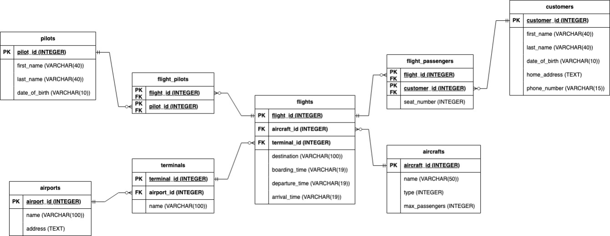

# Airline Database Application

Created for my CM12004: Discrete Maths and Databases unit at university and was awarded 83%. 

## Use

OOP CLI to interact with an SQL database for an airline company with CRUD operations and ability to view summary statistics such as:
- Rank upcoming flights by percentage of used up seats
- Rank a pilot's days of the week based on number of flights
- Get number of flights to a destination per month
- and more...

## Entity Relationship Diagram

